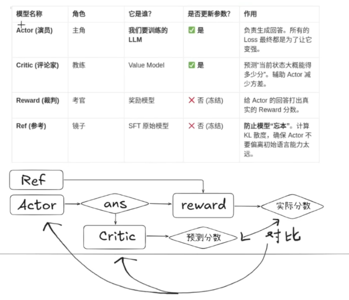
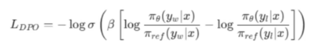

# Note

## RmsNorm
用于归一化神经网络中某一层的输出，使其数值保持稳定.同时计算复杂度小
token(x)输入：(batch_size, seq_len, hidden_dim)，故mean维度为-1，即hidden_dim维度，keepdim=True保持维度不变，输出(batch_size, seq_len, 1),而不是变成unsqueeze()了，再乘以权重weight，输出(batch_size, seq_len, hidden_dim)

## RoPE旋转位置编码
绝对位置编码，如果“A...是x”如果前面加上一段“...A...是x”绝对位置就变了，太呆板
相对位置编码：RoPE最常见，cos编码
感兴趣可以从3角不等式看看使用RoPE的数学原因：把Q[q1,q2]与K[k1,k2]旋转m*θ和n*θ角度，再点积，由3角恒等式得到最终结果因为Q和K是原始值，位置信息只由cos[(m-n)θ]和sin[(m-n)θ]决定，即只和m-n有关
使用时，假设初始“cat”"sat"的位置分别为2和3每个Token有自己的向量列，我们会把列中的多个向量两两分为1组进行旋转，每个向量都有自己的Q和K，第一组旋转θ1角度，第二组旋转θ2角度...点积了之后就变成(2-3)θ1,(2-3)θ2...相对位置信息就隐藏再这里

## YaRNd对RoPE的外推，优化
“外推”是处理超出计算长度的意思
原始的RoPE原始频率在i越大越小，那这样就会：比如说我们的模型是在2048的序列长度进行计算的，那再80亿的一个模型中，都是按照这样的一个长度来理解，如果哪天，给模型塞入一个4000长度，模型会疯掉，因为它处理2048长度的，80亿参数与4000长的匹配不上。
原始方法将4096长压缩到2048（比如乘以一个0.5的系数），但这样会损失一定信息
YaRN对高低频使用不同的处理（将注意力视为一个钟表，高频转的块，能覆盖360度的信息，比如处理2048这样0-6这样一个对数，都落在某个扇形，全在圆内。低频转的慢可能不能覆盖要求的扇形，比其小的扇形）：高频不缩放，保持原样。比如0-6的部分，对低频使用一个线性缩放，对于中频，使用线性插值平滑过渡。**高频对信息精细度的把握,低频是对全局信息的把握**
还引入了一个温度系数，softmax分配注意力机制（20个学生一开始比较关注5个学生，后面塞入3000个学生，还想比较关注这5个学生我的注意力会被分散，因为还要考虑其他3000个）会导致这5个学生的注意力会被稀释，我们加入这个系数再RoPE计算之后传入这个系数让这5个学生依然保持高注意力，其他部分缩放。
使用的话，要找到高低频的界限：2pai*base^(2i/d)
- torch.where(条件,x,y): y为原始输入张量，x张量中符合条件的才通过，并保持原位置，替换掉y中的相应位置元素
- torch.arange(起点，终点，步差):生成等差序列
- torch.outer(x1,x2):x1和x2的外积
- torch.cat(x1,x2,dim=0):在第0个维度进行拼接：size(223->423),如果dim=1则是百年未423的形状
- torch.unsqueeze:自适应增加一个维度
- torch.clamp(x,min,max):计算x中在min和max之间的

## GQA
具体可看3B1B的视频
- torch.tensor.dropout(p=0.x):以多少概率丢弃，防止过拟合
- torch.tensor.liner(x):线性变换，就是乘以ige矩阵
- torch.tensor.view(x):改变形状 [3,4]->[4,3]，但是共享一个物理层
- torch.tensor.transpose(a,b):交换a维和b维(size:233--0,1-->323)
- torch.tensor.triu(x,diagonal=S):只有x时，从对角线下半为0，掩码，diagonal为正数上移S，为负数时下移
- torch.tensor.reshape(x，(...)):类似view(),但是底层不一样,括号里面的维度可以使用-1自动推断减去一个维度
这里的hasattr时查看类是否有什么属性

## FFN
简单的几个线性层而已

## 拼接为Block
- 注意进入前都要使用一个RMSNorm做归一化，自注意力的已经画在图里，但FFN的输入前也要，这里的post是attention“之后”的意思
- 记得残差连接
- FFN在跨层功能不应该一样，用layerid,同时也可以额外MOE使用

## 模型主体model组装
- RoPE预计算：
- forward时，input_ids是经过toker Encorder之后，进入input embedding之前的，给每个单词都分配了一个id,"I love NLP"→ [101, 234, 987],而 input embedding模型有一个矩阵：table W ∈ R^{V × H}，把token_id → W[token_id]，比如234 → embedding vector (size H)。为什么不能直接用 id 做输入？因为：id 是离散的，Transformer 需要连续空间（vector space）
- 之所以要在past_key_value里查找“layer”属性，是因为兼容之前的版本，之前的版本是个对象，现在改成了一个元组
- 记得input embedding转化为向量时也要转化位置信息
- 位置编码position_embeddings之所以是 “整个 seq_len 的一段”，是因为 attention 需要知道每个 token 的绝对位置（或相对旋转角度）,第一次：start_pos = 0,seq_len = → positions: [0,1,2]第二次生成:start_pos = 3,seq_len = 1→ positions: [3],KV cache 让序列变长，但 position 不能重置,position embeddings 不是处理单个 token，而是处理 seq_len 个 token，整个序列中所有 token 的“坐标系”每个 token 都必须有对应的位置编码（RoPE），并且 KV cache 机制要求位置是连续累加的。
- 至于start_pos = past_key_values[0][0].shape[1]?回顾K_cache的维度[B, T_past，H(头数),  D],于是变成T_past，即之前的token数

## 封装，与官方类对应，标准化
- PretrainedModel, GenerationMixin是huggingface的两个标准类，网上的都要继承它两，前者定义模型管理配置，第二个文本生成方法
- 为什么不在 forward 里做 softmax？mokioMindForCausalLM其实只做了一件事lm_head 是：nn.Linear(hidden_size → vocab_size)。输出：logits（未归一化分数）: [B, T, V]所以 softmax 去哪了？在 HuggingFace 体系里：
**情况 A**：训练阶段（最常见）loss 是这样算的：loss = CrossEntropyLoss(logits, labels)而 CrossEntropyLoss 内部做了：log_softmax + NLLLoss 👉 等价于：softmax(logits)但被融合进 loss 里了✔ 所以 softmax 在这里：❗CrossEntropyLoss 内部
**情况 B**：生成（generate）你继承了：GenerationMixin生成时流程是：logits → softmax → sampling/argmax → next token但注意：softmax 在 sampling 函数内部，而不是 model.forward
- 实际上没有完成tokenizer decoder


## Dataset
- 给PAD进行labels防止参与计算时：我们一般因为后面crossloss会自动忽略-100，所以给label=-100。即转化为ids后[1,2,3,PAD] -->[1,2,3,-100]
- 虽然我们时自回归，也就是上述的传入模型的顺序时1，2，3...，为什么时clone下来而不是平移1位呢？因为前面model的部分已经给我们内置了自回归部分
- 虽然input_ids、attention_mask、labels 3者似乎都来自input_ids只是PAD的位置修改了一下，为什么要传3种？但是其实用法不一样：
| 名字               | 给谁用       | 作用                 | 示例   |
| ---------------- | --------- | ------------------ | ---------------|
| `input_ids`      | 模型输入      | 告诉模型“看到什么”         |[BOS, 我, 爱, NLP, EOS, PAD, PAD]|
| `attention_mask` | Attention | 告诉模型“哪些 token 可以看” |[1 1 1 0 0] |
| `labels`         | Loss      | 告诉模型“哪些位置需要算loss”  |为了去预测的监督信号，不是输入|
对于最后一个labels,用法：
| 输入  | 目标labels |
| --- | -------- |
| BOS | 我        |
| 我   | 爱        |
| 爱   | NLP      |
| NLP | EOS      |
PAD 不应该参与 loss故取-100。

## 预训练
- 动态学习率：lr*(0.1 + 0.45*(1+cos(PI*CS/TS)))  #最大为1，最小为0.1，逐渐下降
- 从dataset处获取input_ids、attention_mask、labels
- 向前传播：计算LOSS，反向传播，梯度下降
- 梯度累计：显存时有限的，无法大batch加载，把小的batch加载进来，如把1280的分为160的一次一次处理，每次的梯度累加，最后/8
- 混合精度:32位和16位，使用混合精度的下降,加个scaler放大器:前向传播没事，但 fp16 梯度可能太小（1e-10），变量表示数值范围不够，会溢出，于是反向传播时缩放（*一个炒鸡大的数）fp16 能表示
- 记得datasets是huggingface一个库要安装，跟我们的dataset模块是区分开


## MOE
推理不需要负载均衡只关心效果和速度所以if self.training
注意mean的时候是`沿着维度，也就是相反`


## SFT
- 我们可以看到，在预训练完成后，直接测试其模型，发现大模型只是在做完形填空，比如说“你好”，他会回答“？（接着重复训练文档中的相关内容的你好之后的部分）”，也就是说其只是学会了语言逻辑（各个词的前后关系）但不具备一个对话功能，我们需要其能够像人一样对话
**注意：无论是SFT前后，都是不具备对在为训练的资料的了解的，比如说直接提问“你知道阿嫲的情书嘛？”其回答会开始瞎编只是按照正常的语言逻辑去一个一个输出最可能的结果，不是现实（正确答案）**
- 我们想让其学会对话，实际上主要在prompt（dataset）上做工作，一般的数据集元数据为：{"text": "清晨的阳光透过窗帘洒进房间，桌上的书页被风轻轻翻动。"}我们想要的格式是类似
{
    "conversations": [
        {"role": "user", "content": "你好"},
        {"role": "assistant", "content": "你好！"},
        {"role": "user", "content": "再见"},
        {"role": "assistant", "content": "再见！"}
    ]
}
这样子的对话形SFT数据去训练，主要是让模型学会了对话逻辑，最后我们推理的时候，将自己的提问塞到user里，做一个prompt工程，来与模型对话，模型就会根据学到的数据去放回相关assistant。同时由于之前预训练的大量学习语言逻辑，模型具有其灵活度。这样的一个预训练微调范式。
- create_chat_prompt主要就是为了符合apply_chat_template的参数来形成规范的prompt
- generate_labels只是为了遮住前面的问题部分，因为计算也是计算标准回答和输出回答的loss嘛，要把问题和其他bos什么的遮住（loss 不关注-100），使用一个滑动窗口就行
- 训练目标：Next-Token Prediction（下一个 token 预测）
 数据格式：{"text": "一段原始文本"}
 训练特点：
 模型对整段文本的每个位置都进行预测，没有"只学回复"的区分。
 使用 BOS/EOS 标记文本边界，让模型学会文本的起止。
 PAD token 对应的 label 置 -100，不参与 loss 计算，节省无效梯度。
 labels 直接 clone 自 input_ids（即 X 和 Y 错位一格：Y[t] = X[t+1]）。


## LoRA（低秩自适应）
LoRA 是一种常见的参数高效调优（Parameter-Efficient Fine-Tuning，PEFT）方法。相比全参数调整，它只更新少量新增参数，而保留原始模型主体权重不变，因此成本，也更适合做垂直场景训练。其核心思想是在原支撑重矩阵旁边引入低秩增量分支，仅这部分低秩参数，从而用较小代价完成升级能力。相关实现model_lora.py和train_lora.py整个流程简化手工编写实现，不依赖第三方封装。LoRA很适合处理“如何在保留通用能力的前提下，让模型快速适应南方领域或垂直场景”这类问题。例如基础模型医学知识不足时，就可以在原有模型之上增加层级针对医疗场景的LoRA权重，以较小的代价获得更好的领域表现。通常只需要准备同样的多轮对话格式数据,此时可将【基础模块 + LoRA 权重】组合使用，从而在保留基础模型通用能力的同时，增强特定领域表现。
W = W0 + ΔW = W0 + BA
**注意**：如果有更充足的数据，也可以直接做full_sft全参配置；不过这通常需要更高速地混合通用数据与领域数据，否则很容易过因为一个结构域样本而损失模型原有的通用性。


 ## PPO(近端策略优化)
 近端策略优化,核心：自己做题自己预测


载入数据集的部分与SFT的大致相同，重点看`create_chat_prompt`这里：如何渲染一个喂给模型的prompt的
数据集示例(数据格式与SFT一致，但assistant字段不需要真实内容，因为训练过程中完全由Π策略模型实时采样生成。最后一个一般是空的)：
```
{"conversations": [{"role": "user", "content": "基于以下角色信息完成一段对话\n张明（30岁），一位IT公司的销售经理。外表干练，擅长沟通。最近他需要协助生产部门促销一批新的智能家居产品，但是他对于这些新产品的技术方面并不够熟悉。\n刘琳（25岁），一名来自生产部门的研发工程师。外表看起来有些内向，但实则是一名技术精湛的工程师。最近生产的智能家居产品是她和她的团队开发的。"}, {"role": "assistant", "content": "张明：嗨，刘琳，我听说智能家居产品已经进入了我们公司，我真的很想能够了解一下这些产品的技术方面，以便于在销售中向客户传递正确的信息。\n刘琳：嗨，张明，很高兴为您介绍。这些智能家居产品基于物联网技术开发，并且已经通过了一系列的测试，具有很高的品质保证，其中包括智能插座、智能门锁等产品，您想了解哪些方面？\n张明：首先，我想知道产品的使用前提是什么，例如，在产品安装之前客户需要做哪些准备，以及在使用产品时需要注意哪些事项？\n刘琳：客户使用产品之前需要保证有一个稳定的Wi-Fi网络，因为产品只能够通过Wi-Fi网络进行连接和控制。此外，我们提供了一份详细的使用说明书，其中包含了如何安装和使用产品的所有步骤。\n张明：我也想问一下产品的安全性能如何，客户的隐私是否会被泄露？\n刘琳：我们的产品具有完善的安全措施，可以保证客户的隐私不会泄露。这些措施包括数据加密技术、防火墙以及实时的安全更新等。\n张明：听起来很不错，但是我想问一下，如果客户在使用产品时遇到问题，我们应该如何解决？\n刘琳：我们提供了在线客服服务以及售后服务，如果客户在使用过程中遇到问题，可以随时和我们取得联系，我们会在第一时间为客户解决问题。\n张明：感谢您对我的解答，我对这些产品有了更全面的了解，并且可以更好地向客户介绍这些产品了。\n刘琳：没关系，很高兴能够为您提供帮助。"}, {"role": "user", "content": "基于以上对话提出一个问题。"}, {"role": "assistant", "content": "这些智能家居产品需要哪些前提条件才能够使用？"}, {"role": "user", "content": "请回答这个问题。"}, {"role": "assistant", "content": ""}]}

```
我们拿的只要user提问的部分{"role": "user", "content": "基于以下角色信息完成一段对话\n张明（30岁），一位IT公司的销售经理。外表干练，擅长沟通。最近他需要协助生产部门促销一批新的智能家居产品，但是他对于这些新产品的技术方面并不够熟悉。\n刘琳（25岁），一名来自生产部门的研发工程师。外表看起来有些内向，但实则是一名技术精湛的工程师。最近生产的智能家居产品是她和她的团队开发的。"}放进user里，后面的{"role": "assistant", "content": "张明..}放到对应的assistant里,当然后面去掉最后的一个"assistant"的content，正常其是空的放到answer，两者一起返回，应该是要模型回答出answer

训练部分：
创建critic模型，就是actor基础上加上value头用于价值评估训练。
reward模型,就是自定义规则，比如这个代码里的，是否符合think answer模板，还有就是actor本身回答的质量，两者综合得出
分数。
ref模型和old actor 本身用于评估actor的回答和原本模型的偏离度，防止步子迈大了，保证训练的平稳。

整个epoch的流程为：
1. 开启actor和critic的train模式，因为这两个需要训练调整参数
2. actor模型进行一次生成，解码之后进行reward计算，得到reward模型评判的分数
3. mask去掉pad部分后，送入critic进行价值评估，这里为什么要用last_indices不清楚？
```
回答：这是因为我们处理的是“整句奖励”任务。
1. 稀疏奖励 (Sparse Reward)：
在 RLHF 中，Reward Model 通常只会在句子写完的时候，给出一个分数（比如 8 分）。它不会每写一个字就给一次分。
    ◦ 写第 1 个字：没分 (0)
    ◦ 写第 5 个字：没分 (0)
    ◦ 写最后 1 个字：给分 (8.0)
2. Critic 的任务：
Critic 的任务是预测“从现在开始，未来能拿多少分（Return）”。
    ◦ 在最后一个 token 的位置，Critic 看到了完整的一句话。此时它做出的预测 $V_{last}$，应该完全等于 Reward Model 给的实际分数 $R$。
    ◦ 所以，我们强制让 Critic 在最后一个有效 token 处输出的值，去拟合实际的 Reward。
```
4. 计算advantage，用reward减去critic的估计值
5. 计算actor log概率，表示actor对此次response对信心
6. 先获得actor_model生成的logits
7. 用reponse真实生成的内容对齐logits
8. 用softmax计算概率
9. 用mask去掉prompt部分，只关心response部分的内容
10. 对于old和ref也是一样，只不过不用mask去掉prompt部分
11. 根据old对比计算得出radio，防止更新过大，根据ref计算kl散度，防止忘本
12. 策略损失+价值损失得出总损失，然后反向传播（vf_coef和kf_coef是做什么的？）

## DPO
实际上就是去掉了PPO的ciris的角色，REF和Actor分别去学习以恶搞"学霸"(reward)和“学渣”（loser）的内容，两者计算损失，后面再给一个命题作文，就可以学习到学霸的写作方式。

缺点：容易学习到错误的，以及数据投毒安全风险
优点：减少显存需求，加快计算速度

数据特点(完全成对的)：
```
{
  "chosen": [
    {"content": "Q", "role": "user"}, 
    {"content": "good answer", "role": "assistant"}
  ], 
  "rejected": [
    {"content": "Q", "role": "user"}, 
    {"content": "bad answer", "role": "assistant"}
  ]
}
```
代码部分：
datasets前面的init,len一样,主要是看getitem部分：
提取chosen和rejected的部分分别渲染字符串（prompt_temple）,然后注意这里不是用-100进行掩码（看loss函数）。于是我们使用label=0/1来标注回答部分

train部分:实现上述loss公式，可以结合AI去问。其他的不变，注意Actor和REF虽然仍用同一个init模型，但是DPO这里REF不进行梯度策略更新。

## GRPO
- 由DS飞扬光大，同样摈弃了critic评价网络，用群体相对优势激发出模型的推理性能，其核心在于对逻辑链条类的处理
- 之前的PPO无法预测推理到一半时，某一步是对还是错，且4个模型成本太高了;DPO则是需要构造数据对，构造逻辑链条的某一步是（win,lose），却没办法体会如“品味”的能力，且需要的标注数据量太大（win和lose作为二叉树）
- G(Group,组),R(Relative，相对)
- G指让Actor输出好多好多组答案，比如计算“3+3=？”,会让actor生成4个答案(A.1;B.6,C.6.0;D.7),用外界脚本进行判断(A.0分;B.分;C.1分;D.0分)。R指计算平均分，每个值相对平均分的量。如优势=（自己的量-平均分）/标准差，上述A是-0.5，B是+0.5。所以这里也只需要Actor和REF即可，无需Reward和citics
- 有点类似蚁群寻路沿着信息素最浓的路径的思想， 一个迷宫，用DPO方法得出的放到一个新迷宫就不行了，用PPO成本又太高，而GRPO是直接派出64个小组，根据得到的平均分计算各个的优势，让往优势最高的那个演进
代码：数据集部分和PPO是一样的，需要Actor去生成，而DPO相当于用现成的答案对比。
训练部分：前面的计算计算reward和PPO类似（在模板上规范它的奖罚，看它是否生成了如<think><answer>之类的模板）主要在于num_geneeation超参数来生成多少条答案，后面概率采样之类的处理.R的部分：拿着8个答案的奖励分数去计算优势advantages（这里加1e-8是为了防止除0），还有就是与REF的KL散度处罚，别偏离有模型太多
注意：有些博客也说没用Reward，这是因为相比Critic，Rewaed可以是我们自己定义的一些脚本判断，后者对其的打分代码，而不是一定得是传统我们理解上的大模型；但critic一定是大模型，所以主要这里是说“摈弃了critic”